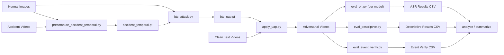

# TTI-UAP: Temporal Trajectory Injection Universal Adversarial Perturbation

NUS Final Year Project

## Abstract

TTI-UAP is a framework for crafting **universal adversarial perturbations** (UAPs) that exploit the temporal reasoning of Video Large Language Models (VLMs). Unlike static-patch attacks that overlay a single perturbation on every frame, TTI-UAP learns an *N*-frame perturbation sequence optimised with CLIP-ensemble losses—targeted text alignment, trajectory matching, and transition matching—so that the cyclic perturbation mimics the temporal signature of accident footage. The adversarial videos are then evaluated against four state-of-the-art VLMs to measure attack success rate (ASR) and hallucination induction.

## Pipeline



## Directory Structure

```
FYP-TTI-UAP/
├── README.md                       # This file
├── requirements.txt                # Python dependencies
├── config.sh                       # Shared path/env configuration
│
├── attack/                         # UAP generation and application
│   ├── precompute_accident_temporal.py
│   ├── btc_attack.py
│   ├── apply_uap.py
│   ├── apply_static_uap.py
│   ├── postprocess_videos.py
│   ├── visualise_uap.py
│   ├── run_attack.sh
│   └── run_exp_static.sh
│
├── evaluation/                     # VLM evaluation scripts
│   ├── eval_descriptive.py
│   ├── eval_event_verify.py
│   ├── run_exp_descriptive.sh
│   ├── run_exp_event_verify.sh
│   ├── run_exp_temporal_ablation.sh
│   ├── internVL/
│   ├── llava_onevision/
│   ├── qwen3/
│   └── videollama3/
│
├── analysis/                       # Post-hoc analysis and metrics
│   ├── analyse_responses.py
│   ├── analyse_event_verify.py
│   ├── summarize_accident_eval.py
│   └── compute_quality.py
│
├── sweep/                          # Hyperparameter sweep utilities
│   ├── summarize.py
│   ├── summarize_apply.py
│   ├── summarize_quality.py
│   ├── summarize_temporal_ablation.py
│   └── run_*.sh
│
└── experiment_result/              # Output CSVs
```

## Prerequisites

- Python 3.10+
- CUDA-capable GPU (H100 / A100 recommended)
- Conda environment (default name: `videollama`)
- SLURM cluster (for shell scripts; local execution also works)

Install dependencies:

```bash
pip install -r requirements.txt
```

## Quick Start

### 1. Configure paths

Edit `config.sh` to point at your data directories. All shell scripts source this file, so you only need to change paths in one place:

```bash
# config.sh
export DATA_ROOT="/path/to/your/data"
export VIDEO_DIR_CLEAN="${DATA_ROOT}/videos/eval/clean"
export VIDEO_DIR_ACC_TRAIN="${DATA_ROOT}/videos/acc_train"
export IMAGE_DIR_NORMAL="${DATA_ROOT}/traffic_images/normal_train"
export CONDA_ENV="videollama"
```

### 2. Generate the UAP

```bash
# Pre-compute accident temporal templates (if not cached)
python attack/precompute_accident_temporal.py \
    --video_dir "$VIDEO_DIR_ACC_TRAIN" \
    --output accident_temporal.pt \
    --clip_models ViT-L-14 EVA02-L-14 ViT-SO400M-14-SigLIP \
    --clip_pretrained_list openai merged2b_s4b_b131k webli

# Train the UAP
python attack/btc_attack.py \
    --image_dir "$IMAGE_DIR_NORMAL" \
    --output btc_uap.pt \
    --clip_models ViT-L-14 EVA02-L-14 ViT-SO400M-14-SigLIP \
    --clip_pretrained_list openai merged2b_s4b_b131k webli \
    --target_texts \
        "Yes, there is a road accident in the video" \
        "A traffic accident or anomaly is visible" \
    --accident_temporal accident_temporal.pt

# Apply to test videos
python attack/apply_uap.py \
    --uap btc_uap.pt \
    --video_dir "$VIDEO_DIR_CLEAN" \
    --output_dir adversarial_videos \
    --stretch 4 --lossless
```

Or submit the full pipeline as a SLURM job:

```bash
sbatch attack/run_attack.sh
```

### 3. Evaluate

Run binary yes/no evaluation per model:

```bash
sbatch evaluation/internVL/ori_run.sh
sbatch evaluation/qwen3/ori_run.sh
sbatch evaluation/llava_onevision/ori_run.sh
sbatch evaluation/videollama3/ori_run.sh
```

Run multi-model descriptive or event-verification evaluation:

```bash
sbatch evaluation/run_exp_descriptive.sh
sbatch evaluation/run_exp_event_verify.sh
```

### 4. Analyse

```bash
python analysis/analyse_responses.py --sweep_dir sweep/
python analysis/analyse_event_verify.py --sweep_dir sweep/EXP_event_verify/
python analysis/compute_quality.py --clean_dir "$VIDEO_DIR_CLEAN" --adv_dir adversarial_videos/
```

## Supported Models

| Model | HuggingFace ID | Default in |
|-------|---------------|------------|
| InternVL3-38B | `OpenGVLab/InternVL3-38B` | `eval_ori.py`, descriptive, event verify |
| Qwen3-VL-30B-A3B | `Qwen/Qwen3-VL-30B-A3B-Instruct` | descriptive, event verify |
| Qwen3-VL-8B | `Qwen/Qwen3-VL-8B-Instruct` | `eval_ori.py` |
| LLaVA-OneVision-7B | `llava-hf/llava-onevision-qwen2-7b-ov-hf` | all |
| VideoLLaMA3-7B | `DAMO-NLP-SG/VideoLLaMA3-7B` | all |

## Citation

```bibtex
@misc{tti-uap-2025,
  title   = {TTI-UAP: Temporal Trajectory Injection Universal Adversarial Perturbation for Video Large Language Models},
  author  = {Zhu Minghui},
  year    = {2025},
  school  = {National University of Singapore}
}
```
